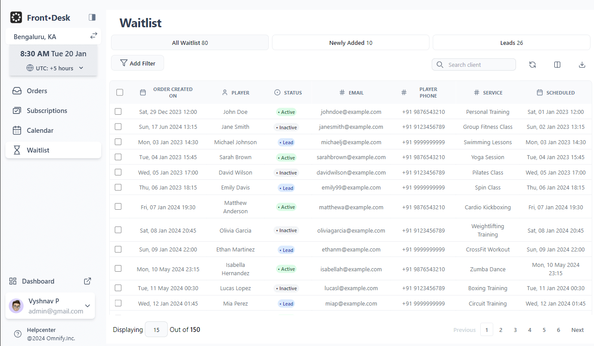

# Dashboard Design with Next.js, Recoil, AOS, and Tailwind CSS



## Overview

This project implements a responsive dashboard interface using modern web technologies. It leverages Next.js for server-side rendering, Recoil for state management, AOS (Animate On Scroll) for animations, and Tailwind CSS for styling. The dashboard is designed to provide a user-friendly interface for managing various aspects of an application, including orders, subscriptions, calendar events, and a waitlist.

## Key Features

- **Next.js**: Utilized for its server-side rendering capabilities, Next.js ensures fast loading times and optimal performance. It simplifies the setup of React applications with its built-in routing and API handling.

- **Recoil**: Chosen for its simplicity and efficiency in managing global state within the application. Recoil's atom-based approach allows components to subscribe to state updates directly, making it easier to maintain and scale state management in complex applications.

- **AOS (Animate On Scroll)**: Integrated to enhance user experience with smooth animations triggered as elements come into view during scrolling. AOS adds visual appeal and helps in guiding user attention to important sections of the dashboard.

- **Tailwind CSS**: Used for styling the components with utility-first CSS classes. Tailwind CSS facilitates rapid prototyping and ensures consistency in design across different screen sizes through its responsive utilities.

## Components and Functionality

- **MobileNavbar**: Provides a collapsible navigation menu for small screens. It includes a logo, location selector, timezone configuration, and navigation items for orders, subscriptions, calendar, and waitlist management.

- **Sidebar**: Offers a persistent sidebar for desktop screens, mirroring the functionality of the MobileNavbar but in a fixed position. It provides quick access to essential features and maintains visibility throughout the user's session.

- **ContentPanel**: The main area where dynamic content related to selected navigation items (orders, subscriptions, etc.) is displayed. It updates based on user interactions with the sidebar or mobile navigation menu.

- **Loader**: A loading spinner displayed during initial page load or when fetching data. It ensures users are informed of ongoing operations and provides a smooth transition before content is fully rendered.

## Deployment and Usage

The project is designed to be easily deployed on platforms like Vercel for seamless hosting and scaling. Developers can clone the repository, install dependencies, and start the development server using `npm run dev` or equivalent commands. The dashboard updates in real-time during development and can be customized further to fit specific application requirements.

## Learn More and Contributions

- **Next.js Documentation**: Offers comprehensive resources on Next.js features and API.
- **Recoil Documentation**: Provides guidelines for implementing Recoil for state management.
- **AOS Documentation**: Explains usage and customization options for AOS animations.
- **Tailwind CSS Documentation**: Includes details on utility-first CSS and responsive design principles.

This project encourages contributions and feedback from the community. Developers can explore the repository, suggest improvements, and contribute to enhancing its functionality and user experience.


This is a [Next.js](https://nextjs.org/) project bootstrapped with [`create-next-app`](https://github.com/vercel/next.js/tree/canary/packages/create-next-app).

## Getting Started

First, run the development server:

```bash
npm run dev
# or
yarn dev
# or
pnpm dev
# or
bun dev
```

Open [http://localhost:3000](http://localhost:3000) with your browser to see the result.

You can start editing the page by modifying `app/page.tsx`. The page auto-updates as you edit the file.

This project uses [`next/font`](https://nextjs.org/docs/basic-features/font-optimization) to automatically optimize and load Inter, a custom Google Font.

## Learn More

To learn more about Next.js, take a look at the following resources:

- [Next.js Documentation](https://nextjs.org/docs) - learn about Next.js features and API.
- [Learn Next.js](https://nextjs.org/learn) - an interactive Next.js tutorial.

You can check out [the Next.js GitHub repository](https://github.com/vercel/next.js/) - your feedback and contributions are welcome!

## Deploy on Vercel

The easiest way to deploy your Next.js app is to use the [Vercel Platform](https://vercel.com/new?utm_medium=default-template&filter=next.js&utm_source=create-next-app&utm_campaign=create-next-app-readme) from the creators of Next.js.

Check out our [Next.js deployment documentation](https://nextjs.org/docs/deployment) for more details.
